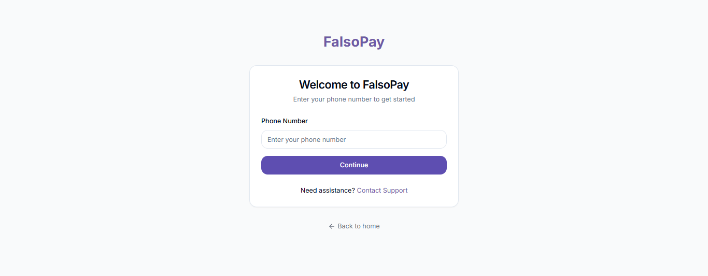
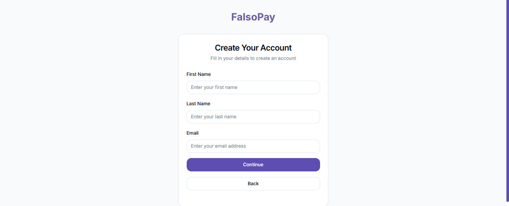
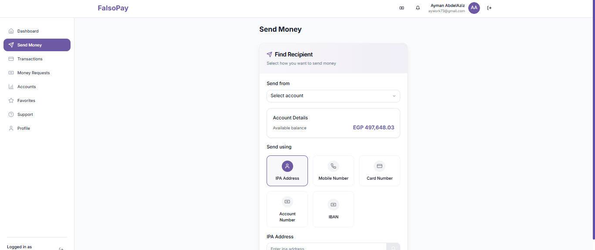
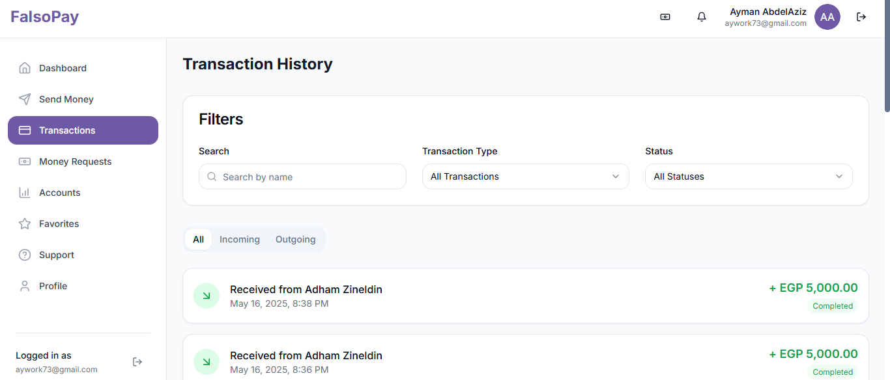
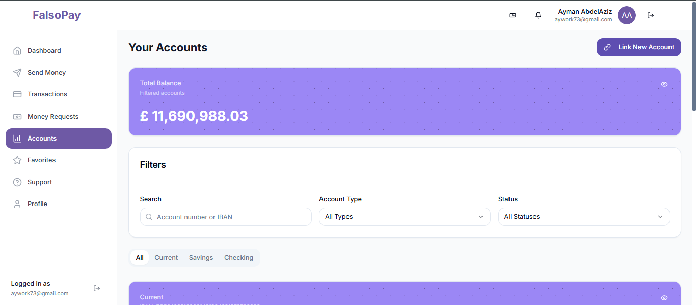
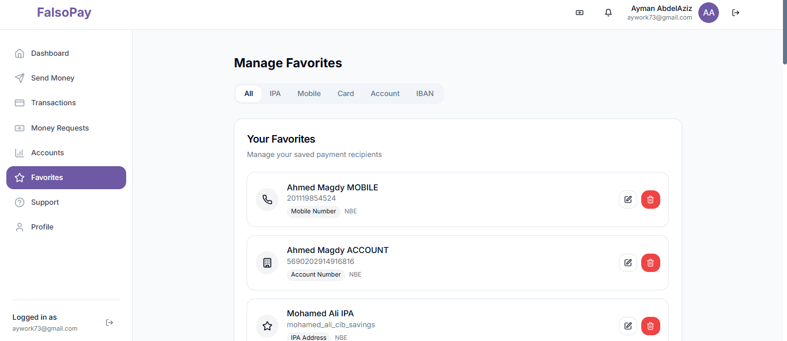
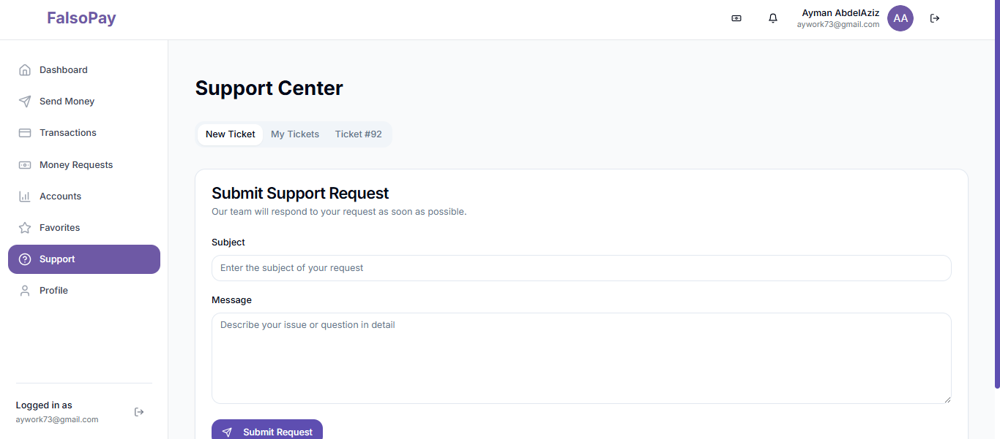
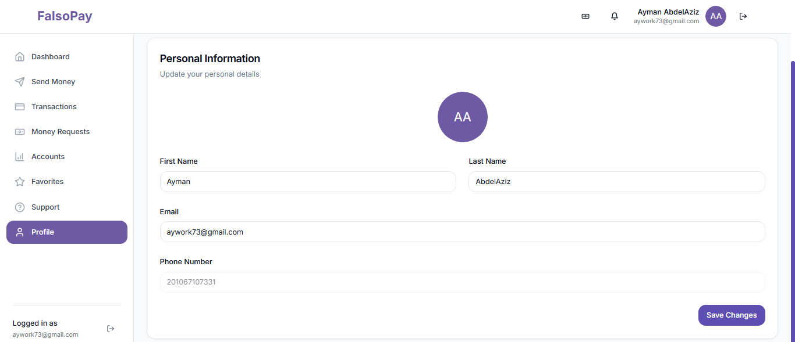
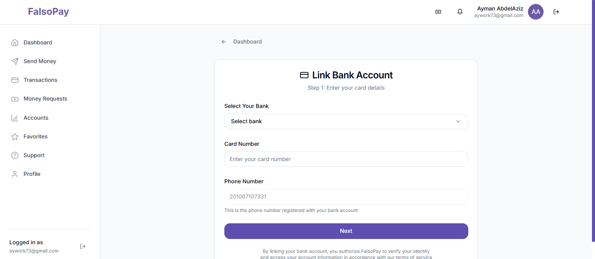

# Falsopay - Modern Banking Platform

Live Demo: [Link](https://app5000.maayn.me)

Falsopay is a full-stack modern banking platform that provides users with a seamless digital banking experience. It supports real-time transactions, virtual and physical card management, multiple bank accounts, and a fully functional support system. Built with a powerful PHP backend and a sleek, type-safe React frontend, Falsopay ensures both performance and security.

---

## 📸 Screenshots

### Login Page


### Dashboard


### Register Page


### Send Money


### Transaction History


### Account Status


### Favorites Account


### Support Center


### Profile Page


### Link Bank Account


---

## ✨ Features

- 🔐 **Secure Authentication**: JWT-based user login and registration
- 💸 **Real-time Transactions**: WebSocket-powered instant money transfers
- 💳 **Card Management**: Virtual and physical card handling
- 🏦 **Multiple Bank Accounts**: Connect and manage several bank accounts
- 📊 **Transaction History**: Complete transaction logs with filters
- 👥 **Favorites Account**: Quick access to favorite recipients
- 🧾 **Account Status**: View account balance and limits
- 📩 **Support Center**: Submit and track support tickets
- ⚙️ **System Settings**: Admin-manageable configuration settings
- 📱 **Responsive UI**: Mobile-first modern interface
- ✅ **Type Safety**: Full TypeScript coverage for frontend logic
- 🧪 **Comprehensive Testing**: PHPUnit and Cypress tests for reliability
- 📚 **API Documentation**: Available at `/api/docs`

---

## 🛠️ Tech Stack

### Backend
- **Language**: PHP 8.2+
- **Framework**: Laravel
- **Authentication**: JWT
- **Database**: MySQL 8.0+
- **Real-time**: WebSocket Server (Ratchet)
- **Testing**: PHPUnit
- **API Style**: RESTful API

### Frontend
- **Library**: React 18
- **Language**: TypeScript
- **Build Tool**: Vite
- **Styling**: Tailwind CSS + Shadcn UI
- **State Management**: React Query
- **Routing**: React Router
- **Validation**: Zod
- **Testing**: Cypress

---

## ⚙️ Installation and Setup

### Prerequisites
Make sure you have the following installed:
- [PHP 8.2+](https://www.php.net/)
- [MySQL 8.0+](https://dev.mysql.com/downloads/mysql/)
- [Node.js 18+](https://nodejs.org/)
- [Composer](https://getcomposer.org/)
- [npm](https://www.npmjs.com/) or [yarn](https://yarnpkg.com/)

---

### 1. Clone the Repository
```bash
git clone https://github.com/yourusername/falsopay.git
cd falsopay
```

---

### 2. Backend Setup
```bash
cd backend
composer install
cp .env.example .env
# Fill in your database credentials in the .env file
php artisan key:generate
```

---

### 3. Frontend Setup
```bash
cd frontend
npm install
cp .env.example .env
# Add frontend environment variables as needed
```

---

### 4. Database Setup
```bash
# Make sure your MySQL server is running
php artisan migrate
php artisan db:seed
```

---

### 5. Run the Application

#### Start Backend Server
```bash
cd backend
php -S 0.0.0.0:4000 -t . server.php 
```

#### Start WebSocket Server
```bash
cd backend
php WebSocketServer.php
```

#### Start Frontend Dev Server
```bash
cd frontend
npm run dev
```

---

## ✅ Testing

### Backend Tests
```bash
cd backend
composer test
```

### Frontend Tests
```bash
cd frontend
npm run test
```

---

## 📘 API Documentation
Once the backend is running, visit:  
`http://localhost:8000/api/docs`

---

## 🔐 Security Features
- JWT-based authentication
- HTTPS support
- CSRF protection
- XSS and SQL injection prevention
- Rate limiting
- Input validation with Zod

---

## 🤝 Contributing

1. Fork the repository
2. Create a new branch:  
   `git checkout -b feature/YourFeatureName`
3. Make your changes and commit:  
   `git commit -m 'Add your feature'`
4. Push to your fork:  
   `git push origin feature/YourFeatureName`
5. Submit a Pull Request

---

## 📝 License
This project is licensed under the **MIT License**. See the [LICENSE](LICENSE) file for more info.

---

## 👤 Author
- Adham Zineldin

---

## 🙌 Acknowledgments

- **Shadcn UI** for modern UI components
- **React Query** for smooth data fetching
- **Tailwind CSS** for utility-first styling
- **PHPUnit & Cypress** for testing confidence
