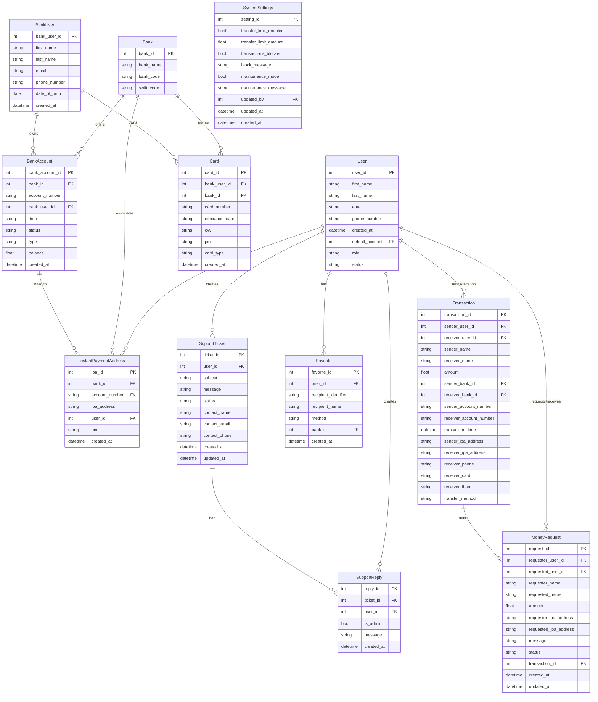

# FalsoPay Database Design

This document provides a comprehensive overview of the FalsoPay database design, including the Entity-Relationship Diagram (ERD) and detailed table specifications.

## Database Overview

The FalsoPay database is designed to support a modern payment system with features including user management, bank account integration, instant payment addressing, transaction processing, money requests, customer support, and system administration.

## Entity-Relationship Diagram

The ERD below illustrates the relationships between the main entities in the FalsoPay system:

## Table Descriptions

### User
Stores registered users of the FalsoPay application.

| Column | Type | Description |
|--------|------|-------------|
| user_id | INT | Primary key, auto-increment |
| first_name | VARCHAR(50) | User's first name |
| last_name | VARCHAR(50) | User's last name |
| email | VARCHAR(100) | Unique email address |
| phone_number | VARCHAR(20) | Unique phone number |
| created_at | DATETIME | Account creation timestamp |
| default_account | INT | Foreign key to preferred bank account |
| role | ENUM | User role (user, admin, agent) |
| status | ENUM | Account status (active, inactive, suspended) |

### Bank
Stores information about banks integrated with FalsoPay.

| Column | Type | Description |
|--------|------|-------------|
| bank_id | INT | Primary key, auto-increment |
| bank_name | VARCHAR(100) | Name of the bank |
| bank_code | VARCHAR(20) | Unique bank code |
| swift_code | VARCHAR(11) | International SWIFT/BIC code |

### BankUser
Stores bank customer information linked to accounts.

| Column | Type | Description |
|--------|------|-------------|
| bank_user_id | INT | Primary key, auto-increment |
| first_name | VARCHAR(50) | Bank user's first name |
| last_name | VARCHAR(50) | Bank user's last name |
| email | VARCHAR(100) | Bank user's email address |
| phone_number | VARCHAR(20) | Bank user's phone number |
| date_of_birth | DATE | Bank user's date of birth |
| created_at | DATETIME | Record creation timestamp |

### BankAccount
Stores bank accounts associated with bank users.

| Column | Type | Description |
|--------|------|-------------|
| bank_account_id | INT | Primary key, auto-increment |
| bank_id | INT | Foreign key to bank |
| account_number | VARCHAR(30) | Account number at the bank |
| bank_user_id | INT | Foreign key to bank user |
| iban | VARCHAR(34) | International Bank Account Number |
| status | ENUM | Account status (active, inactive, suspended, closed) |
| type | ENUM | Account type (checking, savings, credit, loan) |
| balance | DECIMAL(15,2) | Current account balance |
| created_at | DATETIME | Record creation timestamp |

### InstantPaymentAddress
Stores instant payment addresses (similar to usernames for payments).

| Column | Type | Description |
|--------|------|-------------|
| ipa_id | INT | Primary key, auto-increment |
| bank_id | INT | Foreign key to bank (nullable) |
| account_number | VARCHAR(30) | Account number (nullable) |
| ipa_address | VARCHAR(50) | Unique IPA address |
| user_id | INT | Foreign key to user (nullable) |
| pin | CHAR(6) | Encrypted PIN for verification |
| created_at | DATETIME | Record creation timestamp |

### Card
Stores payment cards issued by banks.

| Column | Type | Description |
|--------|------|-------------|
| card_id | INT | Primary key, auto-increment |
| bank_user_id | INT | Foreign key to bank user |
| bank_id | INT | Foreign key to bank |
| card_number | VARCHAR(19) | Unique card number (encrypted) |
| expiration_date | VARCHAR(7) | Card expiration date (MM/YYYY) |
| cvv | CHAR(3) | Card CVV (encrypted) |
| pin | CHAR(4) | Card PIN (encrypted, nullable) |
| card_type | ENUM | Card type (debit, credit) |
| created_at | DATETIME | Record creation timestamp |

### Transaction
Records all money transfers within the system.

| Column | Type | Description |
|--------|------|-------------|
| transaction_id | INT | Primary key, auto-increment |
| sender_user_id | INT | Foreign key to sender user (nullable) |
| receiver_user_id | INT | Foreign key to receiver user (nullable) |
| sender_name | VARCHAR(100) | Name of the sender (nullable) |
| receiver_name | VARCHAR(100) | Name of the receiver (nullable) |
| amount | DECIMAL(15,2) | Transaction amount |
| sender_bank_id | INT | Foreign key to sender's bank (nullable) |
| receiver_bank_id | INT | Foreign key to receiver's bank (nullable) |
| sender_account_number | VARCHAR(30) | Sender's account number (nullable) |
| receiver_account_number | VARCHAR(30) | Receiver's account number (nullable) |
| transaction_time | DATETIME | Transaction timestamp |
| sender_ipa_address | VARCHAR(50) | Sender's IPA address (nullable) |
| receiver_ipa_address | VARCHAR(50) | Receiver's IPA address (nullable) |
| receiver_phone | VARCHAR(20) | Receiver's phone number (nullable) |
| receiver_card | VARCHAR(19) | Receiver's card number (nullable) |
| receiver_iban | VARCHAR(34) | Receiver's IBAN (nullable) |
| transfer_method | ENUM | Method used (ipa, account, card, phone, iban) |

### MoneyRequest
Stores money requests between users.

| Column | Type | Description |
|--------|------|-------------|
| request_id | INT | Primary key, auto-increment |
| requester_user_id | INT | Foreign key to requester user |
| requested_user_id | INT | Foreign key to requested user |
| requester_name | VARCHAR(100) | Name of the requester |
| requested_name | VARCHAR(100) | Name of the requested user |
| amount | DECIMAL(15,2) | Requested amount |
| requester_ipa_address | VARCHAR(50) | Requester's IPA address |
| requested_ipa_address | VARCHAR(50) | Requested user's IPA address |
| message | TEXT | Optional message with the request (nullable) |
| status | ENUM | Request status (pending, accepted, rejected, expired, cancelled) |
| transaction_id | INT | Foreign key to fulfilling transaction (nullable) |
| created_at | DATETIME | Record creation timestamp |
| updated_at | DATETIME | Record update timestamp |

### Favorite
Stores user's favorite payment recipients.

| Column | Type | Description |
|--------|------|-------------|
| favorite_id | INT | Primary key, auto-increment |
| user_id | INT | Foreign key to user |
| recipient_identifier | VARCHAR(100) | Identifier (IPA, account, etc.) |
| recipient_name | VARCHAR(100) | Name of the recipient |
| method | ENUM | Payment method (ipa, account, card, phone, iban) |
| bank_id | INT | Foreign key to bank (nullable) |
| created_at | DATETIME | Record creation timestamp |

### SupportTicket
Stores customer support inquiries.

| Column | Type | Description |
|--------|------|-------------|
| ticket_id | INT | Primary key, auto-increment |
| user_id | INT | Foreign key to user (nullable) |
| subject | VARCHAR(100) | Ticket subject |
| message | TEXT | Ticket message content |
| status | ENUM | Ticket status (open, in_progress, resolved, closed) |
| contact_name | VARCHAR(100) | Contact name (nullable) |
| contact_email | VARCHAR(100) | Contact email (nullable) |
| contact_phone | VARCHAR(20) | Contact phone (nullable) |
| created_at | DATETIME | Record creation timestamp |
| updated_at | DATETIME | Record update timestamp |

### SupportReply
Stores replies to support tickets.

| Column | Type | Description |
|--------|------|-------------|
| reply_id | INT | Primary key, auto-increment |
| ticket_id | INT | Foreign key to support ticket |
| user_id | INT | Foreign key to user |
| is_admin | BOOLEAN | Whether reply is from admin/agent |
| message | TEXT | Reply message content |
| created_at | DATETIME | Record creation timestamp |

### SystemSettings
Stores system-wide settings and configurations.

| Column | Type | Description |
|--------|------|-------------|
| setting_id | INT | Primary key, auto-increment |
| transfer_limit_enabled | BOOLEAN | Whether transfer limits are enabled |
| transfer_limit_amount | DECIMAL(15,2) | Maximum transfer amount |
| transactions_blocked | BOOLEAN | Whether transactions are blocked |
| block_message | TEXT | Message displayed when blocked (nullable) |
| maintenance_mode | BOOLEAN | Whether system is in maintenance mode |
| maintenance_message | TEXT | Maintenance message (nullable) |
| updated_by | INT | Foreign key to user who updated (nullable) |
| updated_at | DATETIME | Record update timestamp |
| created_at | DATETIME | Record creation timestamp |

## Database Relationships

1. A User can have multiple InstantPaymentAddresses
2. A User can have multiple Favorites
3. A User can create multiple SupportTickets and SupportReplies
4. A User can send/receive multiple Transactions and MoneyRequests
5. A Bank can offer multiple BankAccounts and issue multiple Cards
6. A Bank can be associated with multiple InstantPaymentAddresses
7. A BankUser can own multiple BankAccounts and Cards
8. A SupportTicket can have multiple SupportReplies
9. A Transaction can fulfill a MoneyRequest (1-to-1 optional relationship)
10. A BankAccount can be linked to multiple InstantPaymentAddresses

## Indexing Strategy

To optimize database performance, the following indexes are recommended:

1. User table: email, phone_number
2. BankAccount table: (bank_id, account_number)
3. InstantPaymentAddress table: ipa_address, user_id
4. Transaction table: sender_user_id, receiver_user_id, transaction_time
5. MoneyRequest table: requester_user_id, requested_user_id, status
6. SupportTicket table: user_id, status, created_at

## Data Security Considerations

1. All sensitive data like PINs, passwords, and card details should be encrypted
2. Personal identifiable information should be protected according to relevant data protection regulations
3. Database access should be restricted and audited
4. Regular backups should be performed
5. Implement row-level security where appropriate

## Database Maintenance

1. Regular performance monitoring
2. Index optimization
3. Query optimization
4. Regular backups
5. Data archiving strategy for old transactions and support tickets
