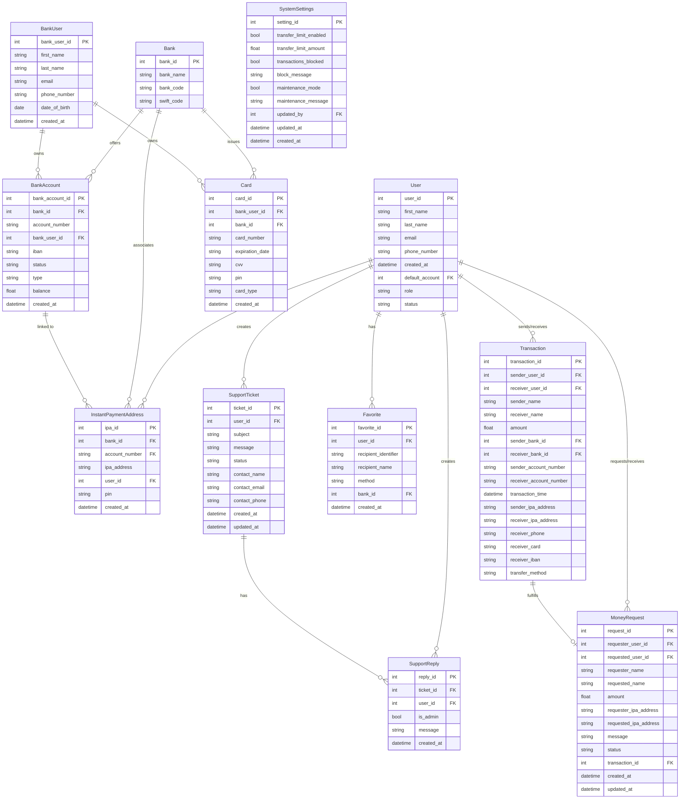

# Falsopay Database ERD

## Table Descriptions

### User
Stores registered users of the Falsopay application.

### Bank
Stores information about banks integrated with Falsopay.

### BankUser
Stores bank customer information linked to accounts.

### BankAccount
Stores bank accounts associated with bank users.

### InstantPaymentAddress
Stores instant payment addresses (similar to usernames for payments).

### Card
Stores payment cards issued by banks.

### Transaction
Records all money transfers within the system.

### MoneyRequest
Stores money requests between users.

### Favorite
Stores user's favorite payment recipients.

### SupportTicket
Stores customer support inquiries.

### SupportReply
Stores replies to support tickets.

### SystemSettings
Stores system-wide settings and configurations.

## Database Relationships

1. A User can have multiple InstantPaymentAddresses
2. A User can have multiple Favorites
3. A User can create multiple SupportTickets and SupportReplies
4. A User can send/receive multiple Transactions and MoneyRequests
5. A Bank can offer multiple BankAccounts and issue multiple Cards
6. A Bank can be associated with multiple InstantPaymentAddresses
7. A BankUser can own multiple BankAccounts and Cards
8. A SupportTicket can have multiple SupportReplies
9. A Transaction can fulfill a MoneyRequest (1-to-1 optional relationship)
10. A BankAccount can be linked to multiple InstantPaymentAddresses 